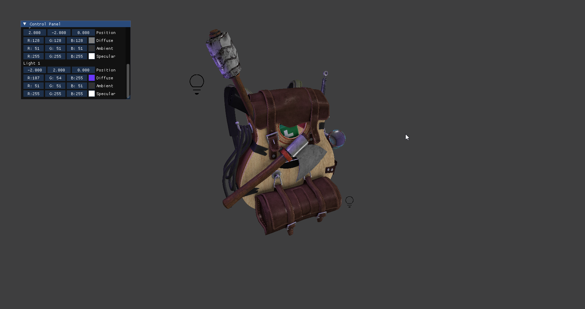

# JVK Engine Base

This is my base Vulkan engine which I build my other projects on top of. It has very basic rasterization capabilities built with a thin wrapper around Vulkan 1.3 (`src/jvk`) and a simplified glTF 2.0 scene graph. The project is built with CMake and C++ 20. Note, this is/was a primarily learning project, so it does not follow a lof Vulkan best-practices. The list of resources I used are in the references section at the bottom.



Since this engine is meant to be specialized per project, I likely won't be adding anymore features.

This engine is currently being used in two of my other projects:
 - [JTX-PathTracer](https://github.com/jebikoh/jvk-pathtracer): an interactive C++/CUDA path tracer
 - Hybrid Rendering Engine (Not Published): a hybrid ray tracing/rasterization engine

## Dependencies

It uses the following Vulkan extensions:
 - Dynamic Rendering (1.3)
 - Synchronization 2 (1.3)
 - Buffer Device Addressing (1.2)
 - Descriptor Indexing (1.2)

And the following external dependencies:
 - [fastgltf](https://github.com/spnda/fastgltf)
 - [glm](https://github.com/g-truc/glm)
 - [ImGui](https://github.com/ocornut/imgui)
 - [SDL2](https://github.com/libsdl-org/SDL)
 - [stb-image](https://github.com/nothings/stb/blob/master/stb_image.h)
 - [vk-bootstrap](https://github.com/charles-lunarg/vk-bootstrap)
 - [vma](https://github.com/GPUOpen-LibrariesAndSDKs/VulkanMemoryAllocator)

These are all vendored in the repository or via git submodules.

## Setup

To build the project, you will need to have the Vulkan SDK installed. All other dependencies are vendored in the repository or via git submodules. After cloning the repository, you can download the submodules with:

```bash
git submodule update --init --recursive
```

The project is built with CMake. Here are the available build options:
 - `JVK_ENABLE_PERF_FLAGS`: will enable compiler specific optimization flags (e.g. `-o3`, `/O2`)
 - `JVK_USE_GLTF_ALPHA_MODE`: will enable the transparent material pass with alpha blending
 - `JKV_ENABLE_BACKFACE_CULLING`: will enable back-face culling; looking to get rid of this via dynamic state.
 - `JVK_LOADER_GENERATE_MIPMAPS`: will generate mipmaps for textures

## References

The project is based off the following resources:
 - [vkguide.dev](https://vkguide.dev/): Initial engine was based off this guide
 - [Vulkan Tutorial](https://vulkan-tutorial.com/): MSAA and other features
 - [nvvk](https://github.com/nvpro-samples/nvpro_core/tree/master/nvvk)
 - [Writing an efficient Vulkan renderer](https://zeux.io/2020/02/27/writing-an-efficient-vulkan-renderer/)
 - [Sascha Willems](https://github.com/SaschaWillems/Vulkan)
